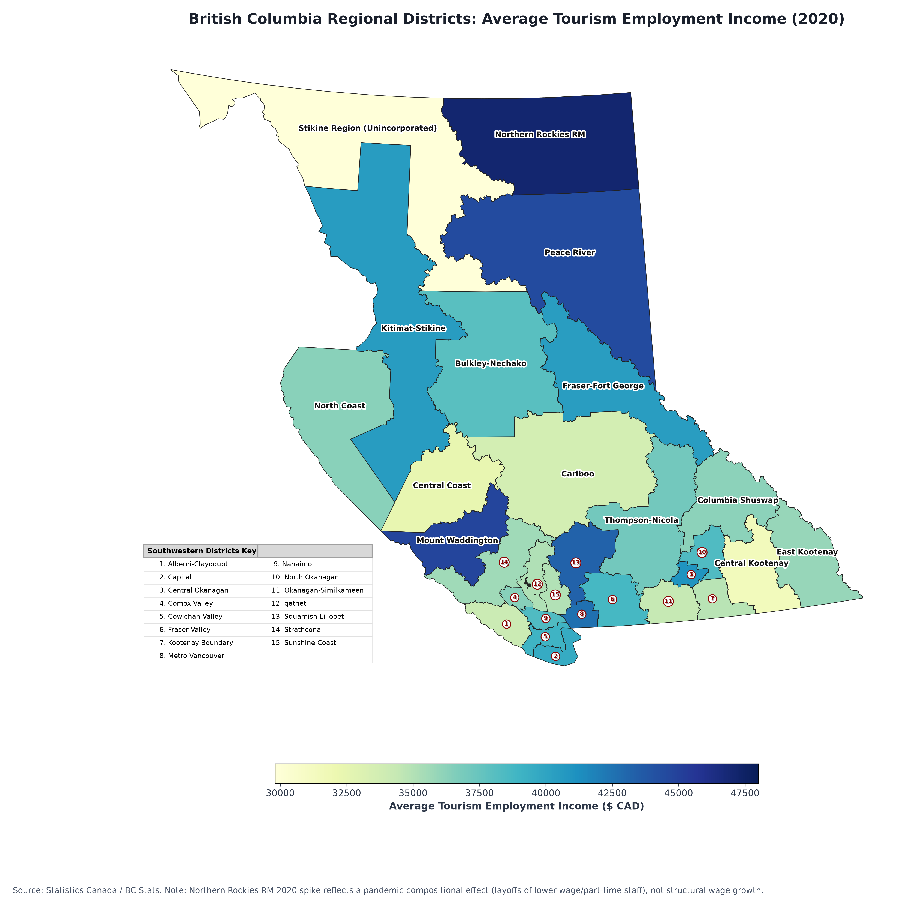
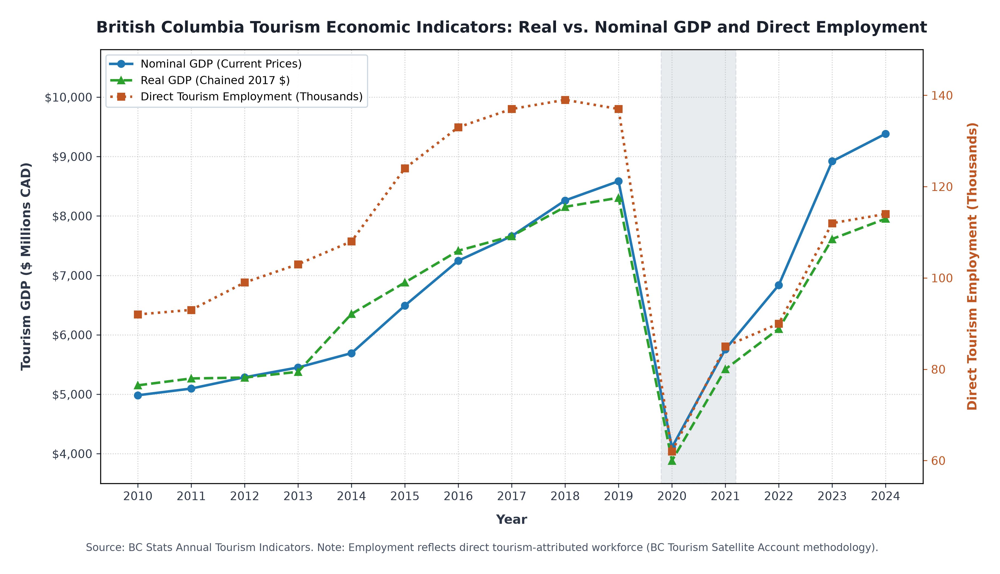
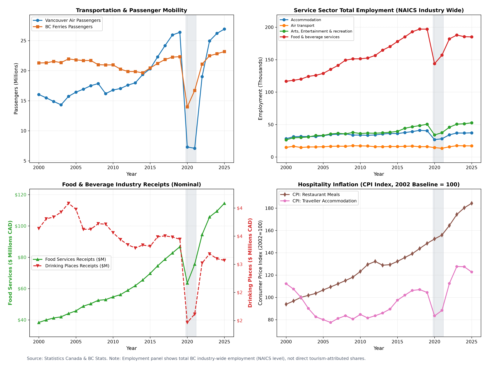

# 2-bc-tourism-gis-analytics

**British Columbia Tourism GIS & Economic Analytics Pipeline**

## Project Overview

An end-to-end spatial data engineering and statistical analytics pipeline for British Columbia tourism indicators, regional workforce dynamics, and macro-level economic performance. The system ingests multi-source administrative boundaries and tabular time-series datasets, normalizes schema inconsistencies, constructs spatial GeoPackage layers, runs non-parametric regional hypothesis testing, and renders production-grade visualizations.

## Directory Structure

```
2-bc-tourism-gis-analytics/
├── data/
│   ├── processed/
│   │   ├── bc_municipalities_clean.gpkg
│   │   ├── bc_regional_districts_clean.gpkg
│   │   ├── bc_regional_tourism_income_joined.gpkg
│   │   ├── bc_stats_annual_indicators_tidy.csv
│   │   ├── indicator_food_services_receipts_annual_tidy.csv
│   │   ├── indicator_food_services_receipts_monthly_tidy.csv
│   │   ├── indicator_tourism_sector_indicators_annual_tidy.csv
│   │   ├── indicator_tourism_sector_indicators_monthly_tidy.csv
│   │   ├── indicator_transportation_indicators_annual_tidy.csv
│   │   ├── indicator_transportation_indicators_monthly_tidy.csv
│   │   ├── indicator_traveller_entries_annual_tidy.csv
│   │   ├── indicator_traveller_entries_monthly_tidy.csv
│   │   └── laep_regional_incomes_tidy.csv
│   └── raw/
│   │   ├── ABMS_MUNICIPALITIES_SP.gpkg
│   │   ├── ABMS_REGIONAL_DISTRICTS_SP.gpkg
│   │   ├── bc_stats_tourism_annual_indicators_tables_2026.csv
│   │   ├── laep-average-incomes-by-area.csv
│   │   └── monthly_tourism_indicators.csv
├── reference/
│   ├── bc_tourism_annual_macro_trends.pdf
│   ├── bc_tourism_annual_macro_trends.png
│   ├── broader_economic_indicators_clean.pdf
│   ├── broader_economic_indicators_clean.png
│   ├── regional_tourism_income_2020.pdf
│   └── regional_tourism_income_2020.png
├── src/
│   ├── clean_data.py
│   ├── hypothesis_tests.py
│   ├── inspect_raw_data.py
│   ├── regional_analysis.py
│   ├── spatial_analysis.py
│   ├── visualizations.py
│   └── visualize_tourism_trends.py
├── tests/
│   ├── conftest.py
│   ├── test_clean_data.py
│   ├── test_hypothesis_tests.py
│   ├── test_processed_data.py
│   ├── test_spatial_analysis.py
│   └── tests_regional_analysis.py
├── .gitignore
├── LICENSE
├── main.py
├── notes.md
├── README.md
└── requirements.txt
```

## Pipeline Architectural Stages

### Stage 1: Raw Data Inspection & Validation

- Validates schema shapes, data types, and projection metadata across CSVs and GeoPackage files.
- Checks boundary integrity (e.g., verifying valid municipal geometries and valid regional district geometries in EPSG:3005 - BC Albers).

### Stage 2: Data Cleaning & Feature Extraction

- Normalizes multi-pivoted CSV indicators into standard tidy format across annual and monthly time horizons.
- Resolves administrative spatial mismatches: isolates the Northern Rockies Regional Municipality from `ABMS_MUNICIPALITIES_SP.gpkg` and merges it with `ABMS_REGIONAL_DISTRICTS_SP.gpkg` to construct a complete 29-region layer (`bc_regional_districts_clean.gpkg`).

### Stage 3: Spatial & Attribute Joins

- Executes spatial and attribute-level merges between cleaned regional boundary polygons and LAEP average tourism employment income time-series.
- Outputs `bc_regional_tourism_income_joined.gpkg` containing 696 combined regional records across 29 unique districts in EPSG:3005.

### Stage 4: Regional Analysis & Metrics Calculation

- Calculates 10-year historical income growth rates (2010–2020) and summary statistics (mean, median, standard deviation, min, max).
- Highlights top income growth districts, such as Kitimat-Stikine (+60.71%) and Stikine Region (+49.00%).

### Stage 5: Non-Parametric Hypothesis Testing

- Runs a two-stage test that evaluates all 8 sub-indicators independently; 5 of 8 sub-indicators exhibit statistically significant global regional differences (p < 0.05).
- Stage 2 uses Benjamini-Hochberg FDR correction (`fdr_bh`) rather than standard Bonferroni.
- Stage 2 returns 0 significant pairwise (Dunn) comparisons due to sample size constraints (n = 3 years per region evaluated across C(29, 2) = 406 pairs), which preserves strict FDR control at the cost of pairwise power.

### Stage 6: Visualization Rendering

- **Choropleth Spatial Map:** Regional District map depicting 2020 average tourism employment income, with capped scale range ($30,000–$48,000 CAD), callout badges for congested southwestern districts, and explanatory notes for pandemic-era compositional shifts (e.g., Northern Rockies RM).
- **Macroeconomic Trends Chart:** Dual-axis plot of real vs. nominal tourism GDP and direct employment trajectories (2010–2024).
- **Broader Economic Dashboard:** 2×2 panel matrix covering transportation passenger mobility, service sector NAICS employment, food and beverage receipts, and hospitality CPI inflation.

## Visualizations

**Regional Tourism Employment Income (2020)**



**Tourism GDP & Employment — Macro Trends (2010–2024)**



**Broader Economic Indicators Dashboard**



## Statistical Summary & Key Findings

### Top Regional Districts by 2020 Average Tourism Employment Income

| Rank | Regional District | Avg. Employment Income (2020) | Note |
|------|--------------------|-------------------------------:|------|
| 1 | Northern Rockies Regional Municipality | $47,100.00 | Reflects pandemic compositional effect due to lower-wage workforce reductions |
| 2 | Mount Waddington Regional District | $44,800.00 | |
| 3 | Peace River Regional District | $44,500.00 | |
| 4 | Squamish-Lillooet Regional District | $43,300.00 | |
| 5 | Metro Vancouver Regional District | $42,600.00 | |

### Top 10-Year Income Growth Rates (2010–2020)

| Regional District | 2010 Income | 2020 Income | 10-Yr Growth |
|--------------------|------------:|------------:|-------------:|
| Kitimat-Stikine | $25,200 | $40,500 | 60.71% |
| Stikine Region (Unincorporated) | $20,000 | $29,800 | 49.00% |
| Bulkley-Nechako | $26,100 | $38,000 | 45.59% |
| Mount Waddington | $31,200 | $44,800 | 43.59% |
| Columbia Shuswap | $25,300 | $36,200 | 43.08% |

## Data Sources

| Dataset | Publisher | Link |
|---|---|---|
| Annual Tourism Indicators | BC Stats | [catalogue.data.gov.bc.ca](https://catalogue.data.gov.bc.ca/dataset/annual-tourism-indicators) |
| Monthly Tourism Indicators | Government of British Columbia | [open.canada.ca](https://open.canada.ca/data/en/dataset/cace513c-9506-4f20-8dd1-7a072034f5fe) |
| Local Area Economic Profiles (LAEP) | BC Stats | [catalogue.data.gov.bc.ca](https://catalogue.data.gov.bc.ca/dataset/2c941f86-146b-4c99-9241-97ef466fff5e) |
| Regional Districts — Legally Defined Administrative Areas of BC | Government of British Columbia | [catalogue.data.gov.bc.ca](https://catalogue.data.gov.bc.ca/dataset/regional-districts-legally-defined-administrative-areas-of-bc) |
| Municipalities — Legally Defined Administrative Areas of BC *(used to isolate Northern Rockies RM prior to the Stage 2 merge)* | Government of British Columbia | [catalogue.data.gov.bc.ca](https://catalogue.data.gov.bc.ca/dataset/municipalities-legally-defined-administrative-areas-of-bc) |

Data provided under the Open Government Licence - British Columbia / Open Government Licence - Canada, as applicable to each source above.

## Execution & Workflow Setup

### Environment Installation

```bash
python -m venv venv
source venv/bin/activate  # On Windows: venv\Scripts\activate
pip install -r requirements.txt
```

### Running the End-to-End Pipeline

To execute data inspection, cleaning, spatial joining, hypothesis testing, and graphic generation in sequence:

```bash
python main.py
```

### Running the Automated Test Suite

```bash
pytest
```